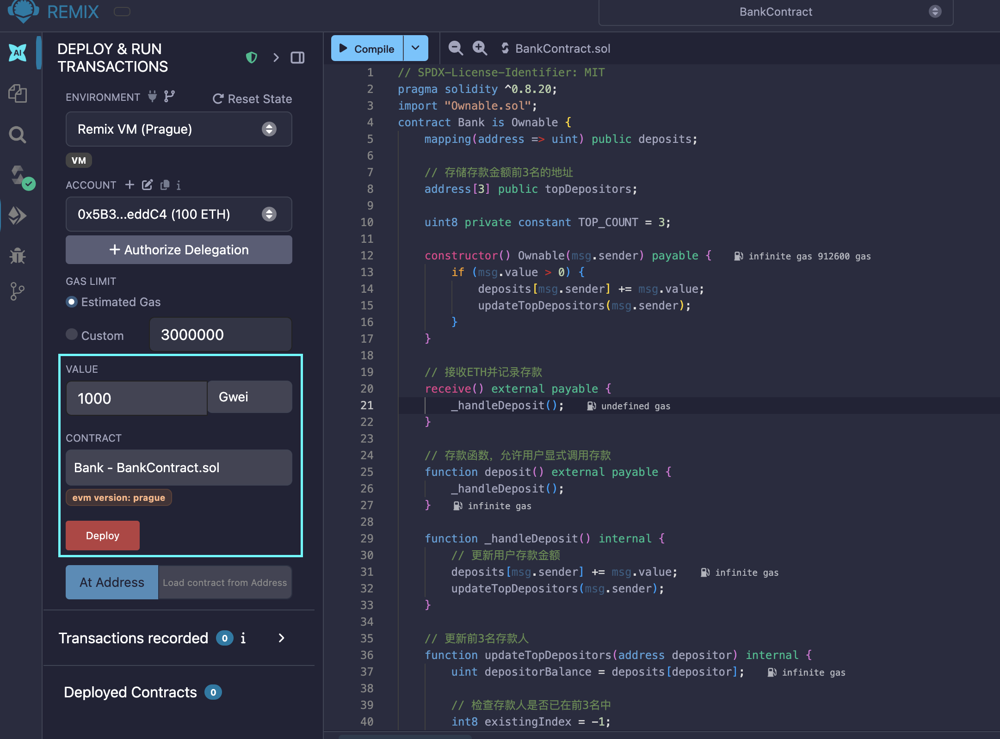
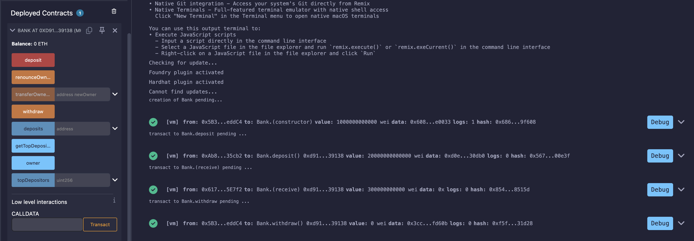

# Bank 合约

一个基于 Solidity 的简单银行合约，支持存款、查询存款排行榜和管理员提款功能。

## 合约结构

```
BankContract/
├── BankContract.sol   # Bank 主合约
├── Ownable.sol        # 权限管理合约（基于 OpenZeppelin v5.0.0）
└── Context.sol        # 执行上下文合约（基于 OpenZeppelin v5.0.1）
```

## 功能说明

### 存款

用户可以通过以下两种方式向合约存入 ETH：

| 方式 | 说明 |
|------|------|
| 直接转账 | 通过 MetaMask 等钱包直接向合约地址发送 ETH，触发 `receive()` 函数 |
| 调用 deposit() | 显式调用 `deposit()` 函数并附带 ETH |

合约会记录每个地址的累计存款金额。

### 存款排行榜

合约维护一个存款金额前 3 名的地址数组 `topDepositors`，按存款金额从高到低排序。

- 调用 `getTopDepositors()` 可查询前 3 名存款人地址及其对应的存款金额

### 管理员提款

- `withdraw()` 仅合约管理员（Owner）可调用
- 将合约中的全部 ETH 余额转入管理员账户

## 函数一览

| 函数 | 可见性 | 说明 |
|------|--------|------|
| `constructor()` | public | 构造函数，支持部署时附带 ETH 作为初始存款 |
| `deposit()` | external payable | 存款入口，记录存款并更新排行榜 |
| `receive()` | external payable | 接收直接转账的 ETH |
| `getTopDepositors()` | external view | 返回前 3 名存款人地址及金额 |
| `withdraw()` | external | 管理员提取合约全部余额 |
| `deposits(address)` | public view | 查询指定地址的累计存款金额 |
| `topDepositors(uint)` | public view | 查询指定排名的存款人地址（0-2） |

## 部署时接收 ETH

构造函数声明为 `payable`，部署合约时可以附带 ETH，该金额会被记录为部署者的初始存款。



## 测试结果



## 依赖

- Solidity `^0.8.20`
- `Ownable` 和 `Context` 合约基于 OpenZeppelin v5 实现，已本地包含在本目录中
