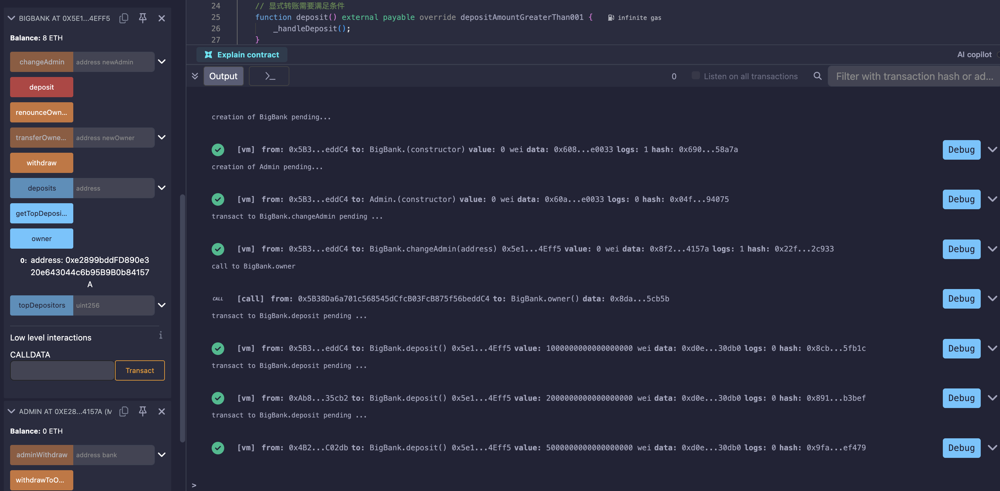
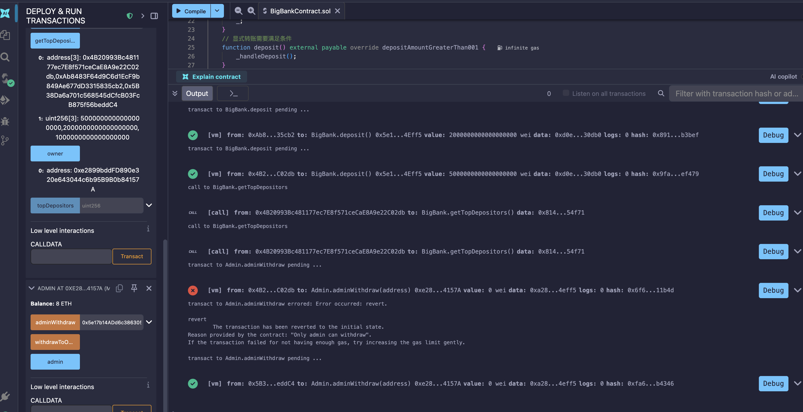

# BigBank 合约说明文档

## 概述

BigBank 是一个基于 Solidity 0.8.20 的存款银行合约，继承自 `Bank` 合约。它在基础银行功能之上增加了存款门槛限制，并提供了一个 `Admin` 合约用于管理多个银行实例。

## 合约架构

```
Ownable (抽象合约)
    └── Bank (合约)
            └── BigBank (合约)

Admin (独立合约)
```

### 依赖关系

- **Ownable**: 提供基础的访问控制机制，包含 `owner` 管理和 `onlyOwner` 修改器
- **Bank**: 提供存款记录、Top 3 存款人排行、管理员提款等基础银行功能
- **IBank**: 银行接口，定义了存款、查询 Top 存款人、提款和查询所有者等标准方法

---

## BigBank 合约

### 核心功能

BigBank 继承 `Bank` 的所有功能，并添加了 **最低存款门槛** 限制。

#### 存款门槛

- **最低存款金额**: 0.001 ETH
- 所有存款操作（显式调用和直接转账）都必须满足此门槛

### 函数列表

#### `deposit() external payable`

显式存款函数。调用者通过此函数向合约存入 ETH。

**修改器**: `depositAmountGreaterThan001`
**要求**: `msg.value > 0.001 ether`
**功能**: 记录存款金额并更新 Top 3 存款人排行

#### `receive() external payable`

接收 ETH 的回调函数。当用户直接向合约地址转账时触发。

**修改器**: `depositAmountGreaterThan001`
**要求**: `msg.value > 0.001 ether`
**功能**: 与 `deposit()` 相同，记录存款并更新排行

#### `changeAdmin(address newAdmin) external`

转移合约管理员权限。

**参数**:
- `newAdmin`: 新管理员地址

**功能**: 委托给 `transferOwnership()` 实现所有权转移
**权限**: 仅当前管理员可调用

#### `depositAmountGreaterThan001` (modifier)

自定义修改器，确保存款金额大于 0.001 ETH。

**错误信息**: `"Deposit amount must be greater than 0.001 ether"`

### 继承的功能（来自 Bank）

#### `getTopDepositors() external view`

查询前 3 名存款人及其存款金额。

**返回值**:
- `address[3]`: Top 3 存款人地址数组
- `uint[3]`: 对应的存款金额数组

#### `withdraw() external`

提取合约中的所有 ETH（仅管理员可调用）。

---

## Admin 合约

### 核心功能

Admin 合约是一个独立的管理层合约，用于统一管理多个银行合约实例。它实现了 **两层权限控制**：

1. Admin 合约自身有管理员 (`admin`)
2. Admin 合约可以作为多个 Bank 合约的所有者

### 状态变量

| 变量名 | 类型 | 说明 |
|--------|------|------|
| `admin` | `address` (immutable) | 合约创建者，拥有最高权限 |

### 函数列表

#### `adminWithdraw(IBank bank) external`

通过 Admin 合约从指定的银行合约中提取资金。

**参数**:
- `bank`: 实现了 `IBank` 接口的银行合约地址

**权限检查**:
1. 调用者必须是 Admin 合约的管理员
2. 目标银行合约的所有者必须是此 Admin 合约地址

**错误信息**:
- `"Only admin can withdraw"`: 非管理员调用
- `"Bank admin must be this Admin contract"`: 银行合约的所有者不是此 Admin 合约

#### `withdrawToOwner() external`

将 Admin 合约中持有的 ETH 提取给 Admin 合约的管理员。

**权限检查**: 调用者必须是 Admin 合约的管理员
**错误信息**:
- `"Only admin can withdraw"`: 非管理员调用
- `"No balance to withdraw"`: 合约余额为 0

#### `receive() external payable`

接收 ETH 的回调函数，允许其他合约或用户向 Admin 合约直接转账。

---

## 使用场景

### 场景一：直接使用 BigBank

```solidity
// 部署 BigBank
BigBank bank = new BigBank();

// 用户存款（必须 > 0.001 ETH）
bank.deposit{value: 0.005 ether}();

// 或者直接向合约地址转账
address(bank).call{value: 0.005 ether}("");

// 查询 Top 3 存款人
(address[3] memory addrs, uint[3] memory amounts) = bank.getTopDepositors();

// 管理员提款
bank.withdraw();
```

### 场景二：使用 Admin 管理多个银行

```solidity
// 部署 Admin 合约
Admin adminContract = new Admin();

// 部署 BigBank
BigBank bank = new BigBank();

// 将银行所有权转移给 Admin 合约
bank.changeAdmin(address(adminContract));

// Admin 合约的管理员从银行提款
adminContract.adminWithdraw(bank);

// Admin 合约的管理员提取 Admin 合约中的 ETH
adminContract.withdrawToOwner();
```

---

## 权限模型

```
用户 ──存款──> BigBank
                   │
                   │ 所有权
                   ▼
              Admin 合约
                   │
                   │ admin 权限
                   ▼
           Admin 合约管理员 (msg.sender)
```

1. **BigBank 所有者**: 拥有调用 `withdraw()` 的权限
2. **Admin 合约**: 作为 BigBank 的所有者，可以调用 `withdraw()`
3. **Admin 合约管理员**: 可以调用 `adminWithdraw()` 从银行提款，也可以调用 `withdrawToOwner()` 提取 Admin 合约中的 ETH

---

## 测试结果

### BigBank 充值测试



### Admin 提现测试



---

## 安全注意事项

1. **存款门槛**: 小于或等于 0.001 ETH 的存款将被拒绝
2. **重入保护**: 当前实现未包含重入攻击保护，建议在生产环境中添加 `ReentrancyGuard`
3. **权限验证**: `Admin` 合约通过双重检查确保只有合法管理员能从银行提款
4. **ETH 转移**: 使用 `call` 进行 ETH 转账，需确保返回值检查已正确实现
