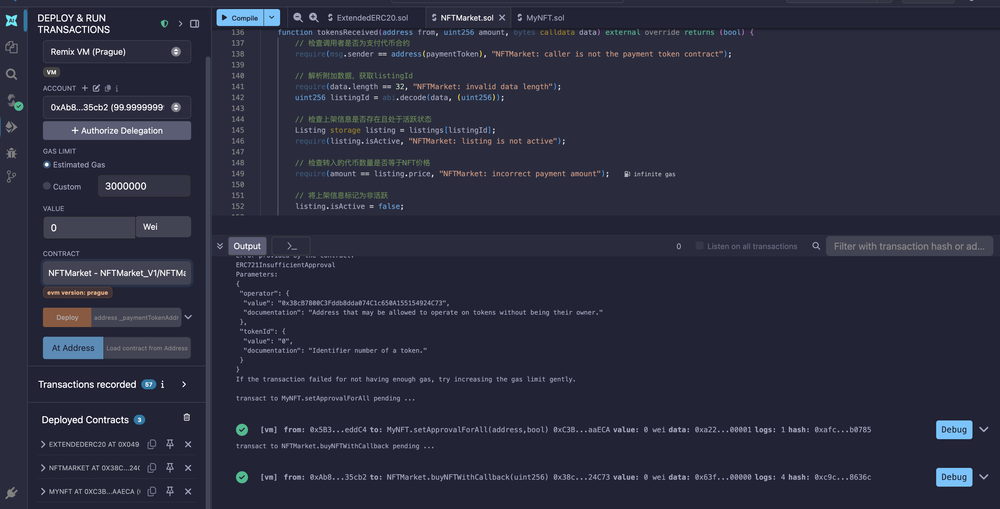

# NFTMarket V1

一个基于 Solidity 的 NFT 市场合约，支持使用自定义 ERC20 代币进行 NFT 的上架、购买和取消操作。

## 项目概述

NFTMarket V1 是一个去中心化的 NFT 交易市场，允许用户使用特定的 ERC20 代币买卖 NFT。项目包含三个核心合约文件：

| 文件 | 说明 |
|------|------|
| `NFTMarket.sol` | 核心市场合约，处理 NFT 上架、购买、取消等逻辑 |
| `ExtendedERC20.sol` | 扩展的 ERC20 代币合约，支持转账回调功能 |
| `ITokenReceiver.sol` | 代币接收回调接口定义 |

## 架构设计

```
┌─────────────────────────────────────────────────────────┐
│                      NFTMarket                          │
│  - list()          上架 NFT                              │
│  - cancelListing() 取消上架                              │
│  - buyNFT()        普通购买（需提前 approve）              │
│  - buyNFTWithCallback() 回调购买（一步完成）               │
│  - tokensReceived() 接收代币回调                          │
└────────────────────────┬────────────────────────────────┘
                         │ 调用
                         ▼
┌─────────────────────────────────────────────────────────┐
│                   ExtendedERC20                         │
│  - transfer()              标准转账                       │
│  - transferFrom()          授权转账                       │
│  - transferWithCallback()  带回调的转账                    │
│  - transferWithCallbackAndData() 带回调和数据的转账        │
└─────────────────────────────────────────────────────────┘
```

## 核心功能

### 1. 上架 NFT (`list`)

卖家将 NFT 上架到市场，设定价格。

```solidity
function list(address _nftContract, uint256 _tokenId, uint256 _price) external returns (uint256)
```

**参数：**
- `_nftContract`：NFT 合约地址
- `_tokenId`：NFT 的 Token ID
- `_price`：售价（以支付代币为单位）

**前置条件：**
- 价格必须大于 0
- 调用者必须是 NFT 所有者或已获授权

**返回：** `listingId`（上架唯一标识）

### 2. 取消上架 (`cancelListing`)

卖家取消已上架的 NFT。

```solidity
function cancelListing(uint256 _listingId) external
```

**前置条件：**
- 上架记录存在且处于活跃状态
- 调用者必须是卖家

### 3. 普通购买 (`buyNFT`)

买家通过标准的 `transferFrom` 方式购买 NFT。

```solidity
function buyNFT(uint256 _listingId) external
```

**前置条件：**
- 上架记录存在且处于活跃状态
- 买家代币余额充足
- 买家已提前调用 `paymentToken.approve()` 授权市场合约

**流程：**
1. 验证上架状态
2. 检查余额
3. 将代币从买家转给卖家（`transferFrom`）
4. 将 NFT 从卖家转给买家
5. 标记上架为非活跃状态

### 4. 回调购买 (`buyNFTWithCallback`)

买家通过回调方式一步完成购买，无需提前 `approve`。

```solidity
function buyNFTWithCallback(uint256 _listingId) external
```

**流程：**
1. 验证上架状态
2. 检查余额
3. 调用 `transferWithCallbackAndData` 将代币转给市场合约，附带 `listingId`
4. 市场合约的 `tokensReceived` 回调被触发
5. 在回调中完成代币转发和 NFT 转移

### 5. 代币接收回调 (`tokensReceived`)

实现 `ITokenReceiver` 接口，处理通过回调方式收到的代币。

```solidity
function tokensReceived(address from, uint256 amount, bytes calldata data) external override returns (bool)
```

**参数：**
- `from`：代币发送方（买家）
- `amount`：转账金额
- `data`：编码的 `listingId`

## 数据结构

### Listing 结构体

```solidity
struct Listing {
    address seller;      // 卖家地址
    address nftContract; // NFT 合约地址
    uint256 tokenId;     // NFT 的 Token ID
    uint256 price;       // 价格
    bool isActive;       // 是否活跃
}
```

### 存储变量

| 变量 | 类型 | 说明 |
|------|------|------|
| `paymentToken` | `IExtendedERC20` | 支付代币合约地址 |
| `listings` | `mapping(uint256 => Listing)` | 上架记录映射表 |
| `nextListingId` | `uint256` | 下一个上架 ID |

## 事件

| 事件 | 说明 |
|------|------|
| `NFTListed` | NFT 上架事件 |
| `NFTSold` | NFT 售出事件 |
| `NFTListingCancelled` | 上架取消事件 |

## 购买方式对比

| 特性 | `buyNFT` | `buyNFTWithCallback` |
|------|----------|----------------------|
| 需要 approve | 是 | 否 |
| 交易步骤 | 两步（approve + buy） | 一步 |
| 代币转移方式 | `transferFrom` | `transferWithCallbackAndData` |
| 适用场景 | 标准 ERC20 流程 | 更便捷的用户体验 |

## ExtendedERC20 回调转账机制

`transferWithCallbackAndData` 使用 `tx.origin` 作为代币发送方，而非 `msg.sender`。这是因为在回调购买场景中，调用链为：

```
用户 → NFTMarket.buyNFTWithCallback() → ExtendedERC20.transferWithCallbackAndData()
```

此时 `msg.sender` 是 `NFTMarket` 合约，而实际持有代币的是原始用户（`tx.origin`）。使用 `tx.origin` 确保余额检查和扣款基于用户地址进行。

### 回调异常处理

`transferWithCallbackAndData` 中对 `tokensReceived` 回调采用细化的 try-catch 处理：

| 分支 | 触发场景 | 处理方式 |
|------|----------|----------|
| `returns (bool success)` | 回调正常返回 | 验证返回值为 `true`，否则 revert |
| `catch Error(string memory reason)` | 回调中 `require`/`revert` 抛出字符串错误 | 原样转发错误信息 |
| `catch (bytes memory lowLevelData)` | 低级错误（自定义错误、assert 失败等） | 通过 assembly 原样回滚错误数据 |

回调失败时整个交易回滚，确保资金安全。

> **注意：** `transferWithCallback` 中的回调失败不会回滚交易（catch 块为空），仅 `transferWithCallbackAndData` 会严格处理。

## 部署

1. 部署 `ExtendedERC20` 合约（支付代币）
2. 部署 `NFTMarket` 合约，传入 `ExtendedERC20` 合约地址作为构造函数参数

```solidity
// 部署示例（伪代码）
ExtendedERC20 token = new ExtendedERC20();
NFTMarket market = new NFTMarket(address(token));
```

## 使用流程

### 卖家上架 NFT

**重要前提：卖家必须先授权 NFTMarket 合约转移 NFT**

由于购买时市场合约会调用 `IERC721.transferFrom(listing.seller, from, listing.tokenId)` 将 NFT 从卖家转移给买家，卖家必须在上架前完成授权。

授权方式有两种：

```solidity
// 方式一：授权单个 NFT（推荐）
nftContract.approve(address(market), tokenId);

// 方式二：授权全部 NFT
nftContract.setApprovalForAll(address(market), true);
```

完整上架流程：

```solidity
// 1. 授权市场合约转移 NFT（必须步骤）
nftContract.approve(address(market), tokenId);

// 2. 上架 NFT，定价 100 代币
uint256 listingId = market.list(nftContractAddress, tokenId, 100);
```

**测试过程注意事项：**

在编写或运行测试时，务必确保执行以下步骤：
1. 部署 NFT 合约和 NFTMarket 合约
2. 测试账户铸造/获取 NFT
3. **调用 `nftContract.approve(address(market), tokenId)` 授权**
4. 调用 `market.list()` 上架
5. 买家购买后，市场合约才能成功执行 `transferFrom` 完成 NFT 转移

如果未授权，购买时会因 `transferFrom` 权限不足而 revert。

### 买家购买（普通方式）

```solidity
// 1. 授权市场合约使用代币
token.approve(address(market), price);

// 2. 购买 NFT
market.buyNFT(listingId);
```

### 买家购买（回调方式）

```solidity
// 一步完成购买，无需提前 approve
market.buyNFTWithCallback(listingId);
```

**测试示例：**



上图展示了通过 `buyNFTWithCallback` 一步完成购买的测试流程，买家无需提前调用 `approve`，即可在单笔交易中完成代币转账与 NFT 接收。

### 卖家取消上架

```solidity
market.cancelListing(listingId);
```

## 安全注意事项

1. **授权检查**：上架时验证调用者是否为 NFT 所有者或已获授权
2. **回调失败处理**：`transferWithCallbackAndData` 中回调失败会回滚交易，确保资金安全；但 `transferWithCallback` 中回调失败不回滚交易
3. **tx.origin 风险**：`transferWithCallbackAndData` 使用 `tx.origin` 进行余额检查和扣款，需确保调用链中不存在中间合约代理的场景，否则 `tx.origin` 可能不是预期地址。tx.origin 是一个 危险的反模式 ，会导致 钓鱼攻击 风险。恶意合约可以诱骗用户调用它，从而冒充用户发起转账。
4. **零地址检查**：关键函数均包含零地址校验
5. **余额检查**：购买前验证买家代币余额
6. **重入风险**：`tokensReceived` 回调在代币转移后执行 NFT 转移，需注意潜在的重入风险

## 技术栈

- **Solidity**: ^0.8.20
- **标准**: ERC20、ERC721
