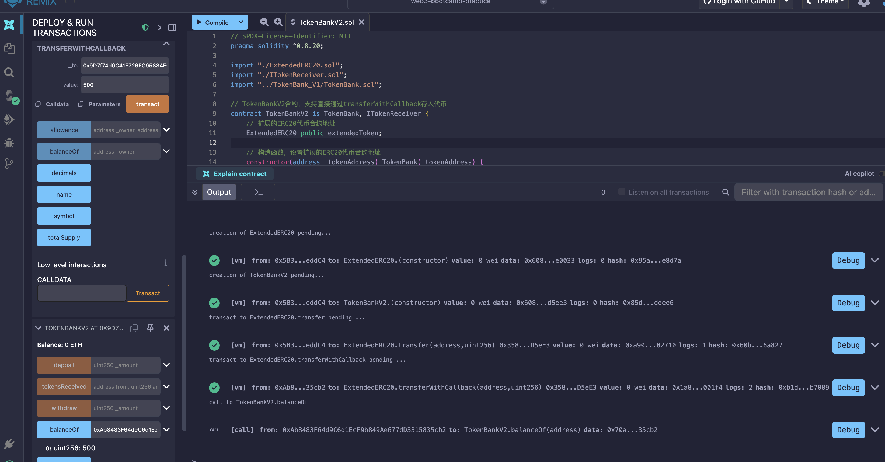

# TokenBank V2

在 TokenBank V1 基础上升级，支持通过 `transferWithCallback` 直接存入代币，无需先调用 `approve` 再调用 `deposit`。

## 项目结构

| 文件 | 说明 |
|---|---|
| `ITokenReceiver.sol` | 代币接收回调接口 |
| `ExtendedERC20.sol` | 扩展的 ERC20 代币，新增 `transferWithCallback` 方法 |
| `TokenBankV2.sol` | 代币银行 V2 合约，继承 V1 并实现回调接口 |

## 合约说明

### ITokenReceiver（ITokenReceiver.sol）

定义代币接收回调接口，供支持回调的代币合约调用。

| 函数 | 说明 |
|---|---|
| `tokensReceived(address, uint256)` | 代币转入合约时触发的回调，参数为发送方地址和金额 |

### ExtendedERC20（ExtendedERC20.sol）

在标准 ERC20 基础上增加了 `transferWithCallback` 方法。

**新增函数**:

| 函数 | 说明 |
|---|---|
| `transferWithCallback(address, uint256)` | 向目标地址转账，若目标为合约则调用其 `tokensReceived` 回调 |

### TokenBankV2（TokenBankV2.sol）

继承自 `TokenBank`（V1），实现 `ITokenReceiver` 接口。

**新增特性**:

- 通过 `transferWithCallback` 转账到 TokenBankV2 时，自动完成存款记录更新，无需额外调用 `deposit`。
- 继承了 V1 的所有功能：`deposit`、`withdraw`、`balanceOf`、`token`。

## 与 V1 的区别

| 特性 | V1 | V2 |
|---|---|---|
| 存款方式 | 先 `approve` 再 `deposit`（两步） | 直接 `transferWithCallback`（一步） |
| 兼容性 | 标准 ERC20 | 需要支持回调的 ExtendedERC20 |

## 使用流程

### 1. 部署代币合约

部署 `ExtendedERC20` 合约。

### 2. 部署银行合约

部署 `TokenBankV2` 合约，传入 `ExtendedERC20` 的合约地址。

### 3. 存款操作（简化）

```
// 一步完成存款，无需先 approve
extendedERC20.transferWithCallback(tokenBankV2地址, 存款金额)
```

### 4. 提款操作

```
tokenBankV2.withdraw(提取金额)
```

### 5. 查询余额

```
tokenBankV2.balanceOf(用户地址)
```

## 测试结果



## 编译环境

- Solidity 版本: `^0.8.20`
