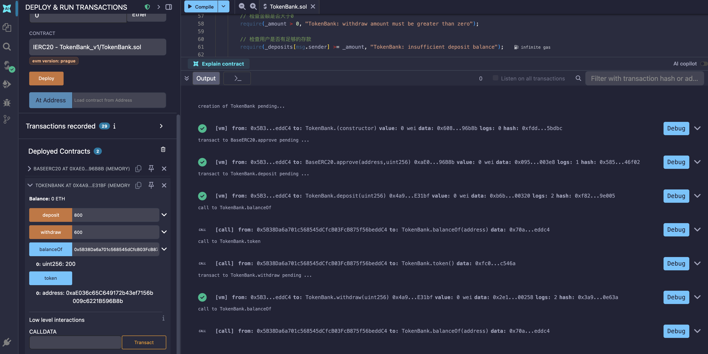

# TokenBank

基于 Solidity 0.8.20 的 ERC20 代币银行合约，支持用户存入和提取 ERC20 代币。

## 项目结构

| 文件 | 说明 |
|---|---|
| `TokenBank.sol` | 代币银行主合约 |
| `ERC20.sol` | ERC20 代币实现（用于测试） |

## 合约说明

### BaseERC20（ERC20.sol）

一个标准的 ERC20 代币实现，用于配合 TokenBank 合约进行测试。

- **代币名称**: BaseERC20
- **代币符号**: BERC20
- **精度**: 18
- **总供应量**: 100,000,000 BERC20（部署时全部分配给部署者）

**核心函数**:

| 函数 | 说明 |
|---|---|
| `name()` | 返回代币名称 |
| `symbol()` | 返回代币符号 |
| `decimals()` | 返回代币精度 |
| `totalSupply()` | 返回总供应量 |
| `balanceOf(address)` | 查询指定地址的代币余额 |
| `transfer(address, uint256)` | 向指定地址转账 |
| `transferFrom(address, address, uint256)` | 从授权地址代转账 |
| `approve(address, uint256)` | 授权指定地址代转额度 |
| `allowance(address, address)` | 查询授权额度 |

### TokenBank（TokenBank.sol）

代币银行合约，允许用户将 ERC20 代币存入合约，并在需要时提取。

**核心函数**:

| 函数 | 说明 |
|---|---|
| `constructor(address)` | 构造函数，绑定目标 ERC20 代币合约地址 |
| `token()` | 返回绑定的代币合约地址 |
| `deposit(uint256)` | 存入指定数量的代币 |
| `withdraw(uint256)` | 提取指定数量的代币 |
| `balanceOf(address)` | 查询用户在银行中的存款余额 |

**事件**:

| 事件 | 说明 |
|---|---|
| `Deposit(address, uint256)` | 用户存款时触发 |
| `Withdraw(address, uint256)` | 用户提款时触发 |

## 使用流程

### 1. 部署代币合约

首先部署 `BaseERC20` 合约，部署者将获得全部 1 亿枚代币。

### 2. 部署银行合约

部署 `TokenBank` 合约，传入 `BaseERC20` 的合约地址作为参数。

### 3. 存款操作

用户在存款前需要先授权 TokenBank 合约：

```
// 步骤 1: 用户调用 ERC20 合约的 approve 方法
token.approve(tokenBank地址, 存款金额)

// 步骤 2: 用户调用 TokenBank 合约的 deposit 方法
tokenBank.deposit(存款金额)
```

### 4. 提款操作

用户直接调用 TokenBank 合约的 withdraw 方法：

```
tokenBank.withdraw(提取金额)
```

### 5. 查询余额

```
// 查询用户在银行的存款余额
tokenBank.balanceOf(用户地址)

// 查询用户钱包中的代币余额
token.balanceOf(用户地址)
```

## 安全设计

- **防重入攻击**: `withdraw` 函数采用"先更新状态，后转账"的模式（Checks-Effects-Interactions），防止重入攻击。
- **零地址校验**: 构造函数中校验代币合约地址不能为零地址。
- **金额校验**: 存款和取款金额必须大于零。
- **余额校验**: 操作前校验用户代币余额和银行存款余额是否充足。

## 测试结果



## 编译环境

- Solidity 版本: `^0.8.20`
